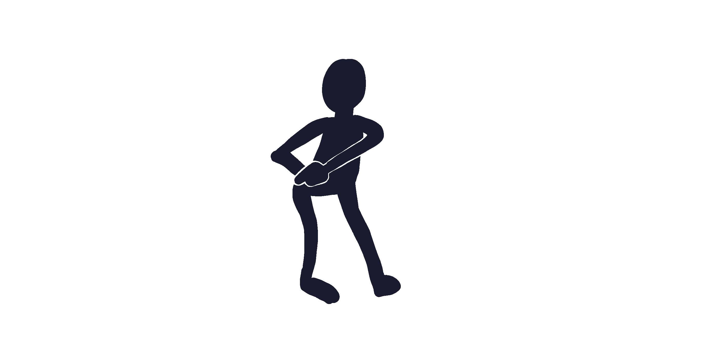

::: {.flicker-container}

🎃

🦇

👻

🕷️

🕸️

🦇

🎃

🕷️

👻

🕸️

🦇

🎃

:::

::: {.invite-wrapper}

[We turn 60. Spooky!]{.top-title}

::: {.photo-container}

:::

[Come retire us]{.bottom-title}

::: {.event-details}

[Spooktober 31, 2026 at 20:00 Dockplatsen 1, 211 15 Malmö Bring your own beer & [Bring your own music](https://open.spotify.com/playlist/2osW9LPMxdvfiTHTUlYnGl?si=v1AXcYn_QZOS8I3URvkKKw)]{.detail-line}

[Get ready to quiz!]{.highlight-line}
[There will be a prize for the best Halloween costume!]{.highlight-line .second}

[Call Jonathan to be let in to level 5 when you arrive on [+46 72 403 81 26](tel:+46724038126)]{.detail-line}

[Your Grandpas Jonathan and Jonas]{.detail-line}

[🕸️ Add to calendar](files/60years.ics){.calendar-button}

:::

:::